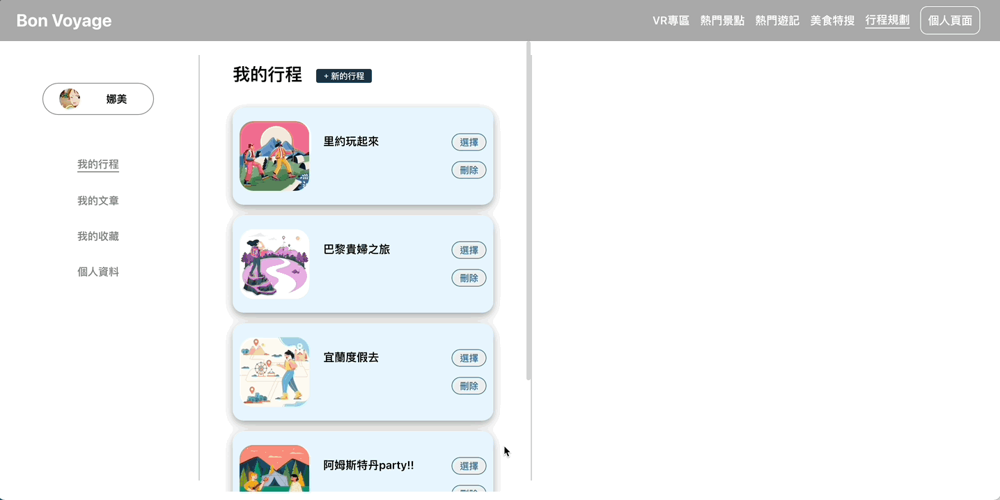
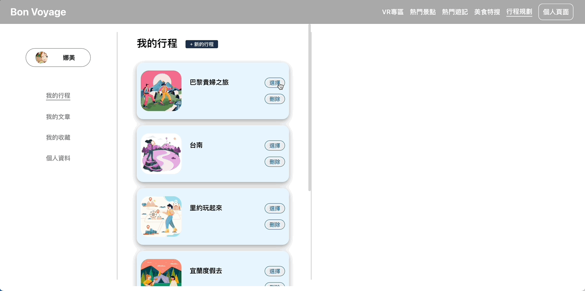
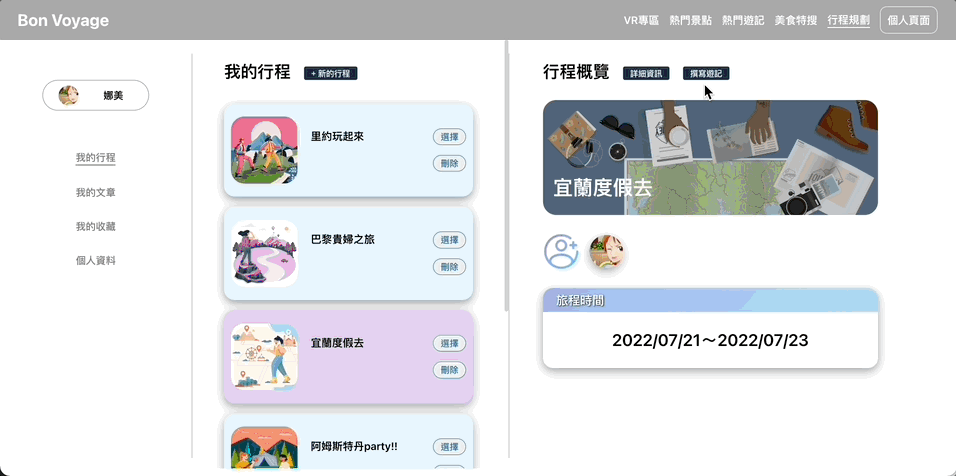
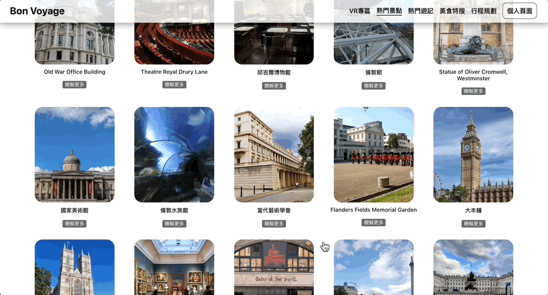

# Bon Voyage 

> #### A World Exploring and Trip Planning Website           
>
>   Fun fact: `"Bon Voyage!"` means "Have a nice trip!" in French.

  - [Motivation](#motivation)
  - [Embark Now!](#embark-now)
  - [Development skills and utilized tools](#developed-with--and)
  - [Features](#features)
      - [`Create your travel schedules` ](#create-your-travel-schedules)
      - [`Add friends to schedules and chat with them.`](#add-friends-to-schedules-and-chat-with-them)
      - [`Adjust schedule detail`](#adjust-schedule-detail)
      - [`Search travel destinations`](#search-travel-destinations)
      - [`Search places by different categories`](#search-places-by-different-categories)
      - [`Edit & publish travel blogs`](#edit--publish-travel-blogs)
      - [`Discover travel blogs written by others`](#discover-travel-blogs-written-by-others)
      - [`Virtual Reality`](#virtual-reality)
      - [`Add to favorite`](#add-to-favorite)
  - [Contact](#contact)

## Motivation

"Life is a journey, not a destination", so goes the saying. Scheduling a new trip from tourist-attraction searching to arrange travel itineary is always pretty time-consuming. Not to mention writing travel blogs on recalling places been to. "Bon Voyage" aims to integrate all these features and give users a wonderful user experiences before and after a trip!

## Embark Now!

Let's unfold a wonderful trip : **[Bon Voyage](https://bonvoyage-f5e7d.web.app/)**

##### <em>Reminder: For a more thorough user experience, please allow location access and sign up.</em>

## Developed with  and

- Front-End Fundamentals
  - React / React Hooks
  - React-Router
  - Styled Components / CSS Keyframes
  - Google Maps API Services: Places API (Place Detail, Nearby Search), Direction, Distance, Geocoding API.
  - Web onDrag / onDrop API
- Firebase Services
  - Authentication
  - Firestore Database
  - Cloud Storage
  - Hosting
- Packages
  - immer
  - useImmer
  - @react-google-maps/api
  - use-places-autocomplete
  - react-router-hash-link
  - swiper.js
  - react-datepicker
- Other
  - Tool: ESLint
  - Version Control: Git / GitHub

## Features

#### `Create your travel schedules` 
Create new schedules and add places by searching.
 

#### `Add friends to schedules and chat with them.`
- Invite friends to join schedules.
- Chat with friends and get instant messages from them.
 

#### `Adjust schedule detail`
- Real-time update when other members edit.
- Drag and drop function to to change order.
- Get direction, distance and driving time right after adding new places.
- Mark routes and place in different days with different colors.
 

#### `Search travel destinations`
Search tourist-attractions / restaurants / hotels and add to existed schedules.
 

#### `Search places by different categories`
Search places by categories such as Food / Camping / Nightlife / Family /Couple / Shopping / Religion / Artistic.
 

#### `Edit & publish travel blogs`
Based on existed schedules, write contents and add images to share with others.
 

#### `Discover travel blogs written by others`
Read travel blogs written by other users and scroll to specified area on clicking titles.
 

#### `Virtual Reality`
Experience VR in 360 degree photo, get closer to the monuments, just like being at the place in person.
 

#### `Add to favorite`
Click star and add favorite places and articles to my-favorite area.
 

## Contact

Feel free to contact if you have any suggestions!
 
Weiwei WANG / wutamy77@gmail.com

